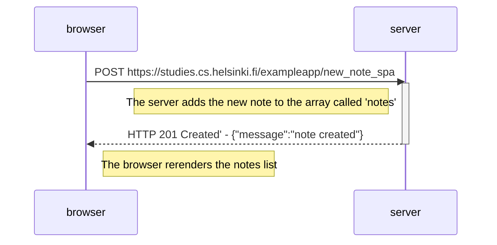

```mermaid
sequenceDiagram
    participant browser
    participant server

    browser->>server: POST https://studies.cs.helsinki.fi/exampleapp/new_note_spa
    activate server

    Note left of server: The server adds the new note to the array called 'notes'

    server-->>browser: HTTP 201 Created' - {"message":"note created"}
    deactivate server

     Note right of browser: The browser rerenders the notes list
```
